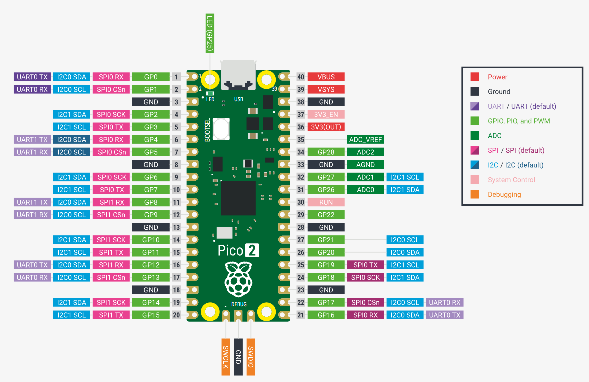

# RTOS勉強会 第0回
## 環境構築編
https://github.com/yugoueda/RTOS/tree/main
githubで検索 yugoueda in:name type:user

---

## 今回の目標

- zephyrOS開発環境をセットアップする
- 動作確認を行う

---

## 環境構築の流れ
### 参考サイト
https://tech-and-investment.com/raspberrypi-pico2-05-zephyr01/

1. 必要なツールのインストール
2. Zephyr RTOS のセットアップ
3. サンプルプロジェクトのビルド
4. 動作確認

---

## ステップ 1: 必要なツール

### インストール対象
- **Python 3.8 以上**
- **Git**
- **CMake 3.20 以上**
- **west**
- **zephyrSDK**
- **openOCD**

---


## ステップ 2: Zephyr RTOS セットアップ

```bash
# 管理者権限のpowershellで実行する
# chocolateyのインストール
Set-ExecutionPolicy Bypass -Scope Process -Force
[System.Net.ServicePointManager]::SecurityProtocol = `
    [System.Net.ServicePointManager]::SecurityProtocol -bor 3072
iex (
    (New-Object System.Net.WebClient).DownloadString(
        'https://community.chocolatey.org/install.ps1'
    )
)
```
---
## ステップ 2: Zephyr RTOS セットアップ
```bash
# 確認メッセージの無効化
choco feature enable -n allowGlobalConfirmation

# cmakeインストール
choco install cmake --installargs 'ADD_CMAKE_TO_PATH=System'

#その他関連ツールのインストール
choco install ninja gperf python311 git dtc-msys2 wget 7zip
```

---

## ステップ 3: Python仮想環境の整備

```bash
# 通常ユーザのpowershellで実行する
# 仮想環境の作成
python -m venv zephyrproject\.venv
# 仮想環境のアクティブ化
.\.venv\Scripts\Activate.ps1
#batの実行に以下が必要かも
Set-ExecutionPolicy -Scope CurrentUser -ExecutionPolicy RemoteSigned

```
---

## ステップ 3: Python仮想環境の整備

```bash
# 通常ユーザのpowershellで実行する
# westインストール
pip install west

# west初期化
west init ~/zephyrproject

# 作成したディレクトリに移動
cd ~/zephyrproject

#更新
west update

west zephyr-export

west packages pip --install
```

---

## ステップ 4: Zephyr RTOS セットアップ

```bash
# Zephyr SDKのダウンロード
cd %HOMEPATH%\zephyrproject\zephyr
west sdk install
```
---

## ステップ 5: OpenOCDのインストール
- 下記からDLして展開したフォルダをProgramFilesに配置
```bash
https://gnutoolchains.com/arm-eabi/openocd
```
- `C:\Program Files\OpenOCD\bin`をシステム環境変数に追加

---

## 電子基板を扱う上での注意点

1. **通電中はICに触らない**  
   - 感電防止とショート防止

2. **伝導性のある素材の上に直置きしない**  
   - アルミ板や金属机などでショートのリスク

3. **静電気に気を付ける**  
   - 静電防止手袋やアースバンドでIC破損を防ぐ

4. **抵抗なしで電源とGNDを直接繋ぐような回路は組まない**  
   - GPIOやICピンが破壊される原因
---

## ブレッドボードの仕組み
### 参考サイト
https://note.com/shingo_shirogane/n/n235af8d5d794

---
## ラズパイPico2回路図
### 参考サイト
- https://docs.sunfounder.com/projects/newton-lab-kit/ja/latest/raspberry_pi_pico2.html

---

---

## Zephyrとは
### 参考サイト
https://www.windriver.com/japan/solutions/learning/what-is-zephyr
https://docs.zephyrproject.org/latest/index.html

---
## ステップ 6: サンプルプロジェクトのビルド
```bash
# Hello,Worldのビルド
west build -p always -b rpi_pico2/rp2350a/m33 samples/basic/blinky
# ボードへ書き込み
west flash
```

```bash
# Lチカプログラムのビルド
west build -p always -b rpi_pico2/rp2350a/m33 samples/basic/blinky
# ボードへ書き込み
west flash
```
---

## ステップ 7: 動作確認

✅ サンプルが正常にビルドできたか
✅ 実行結果が表示されたか
```
#COM3ポートに以下が表示される
*** Booting Zephyr OS build v4.3.0-6636-g3a40c90b9801 ***
Hello World! rpi_pico2/rp2350a/m33
```
✅ エラーはないか

これで環境構築は完了です！

---

## 次回の予告

### 第1回：RTOSとは何かを体験で掴む

- RTOSとLinuxの違い
- ジッタとは
- タスクとスレッドの違い

---


## 終了

次回開催日→

